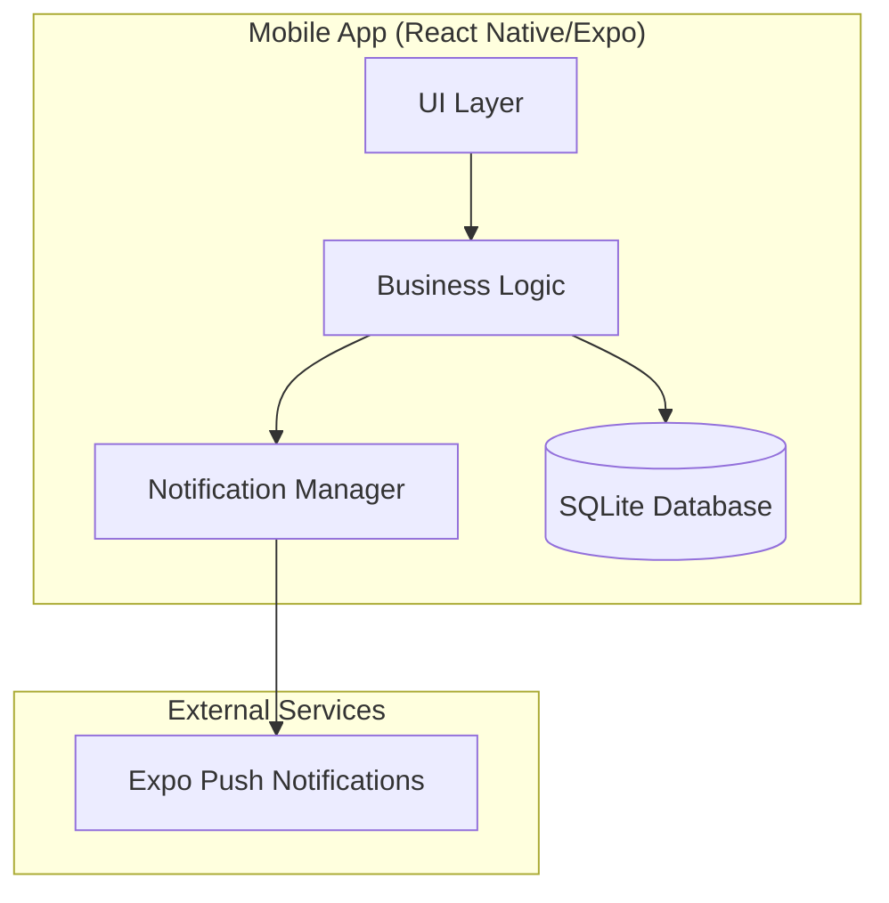
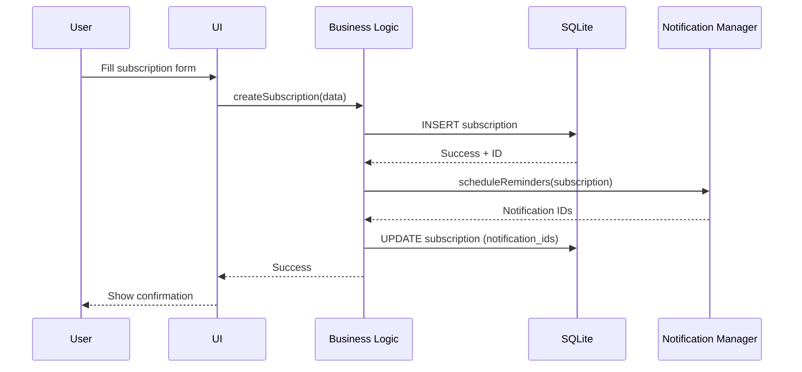
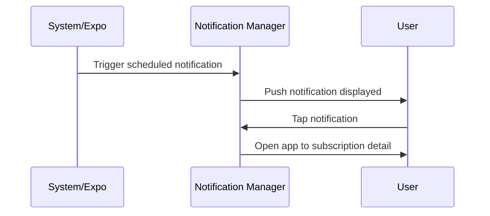
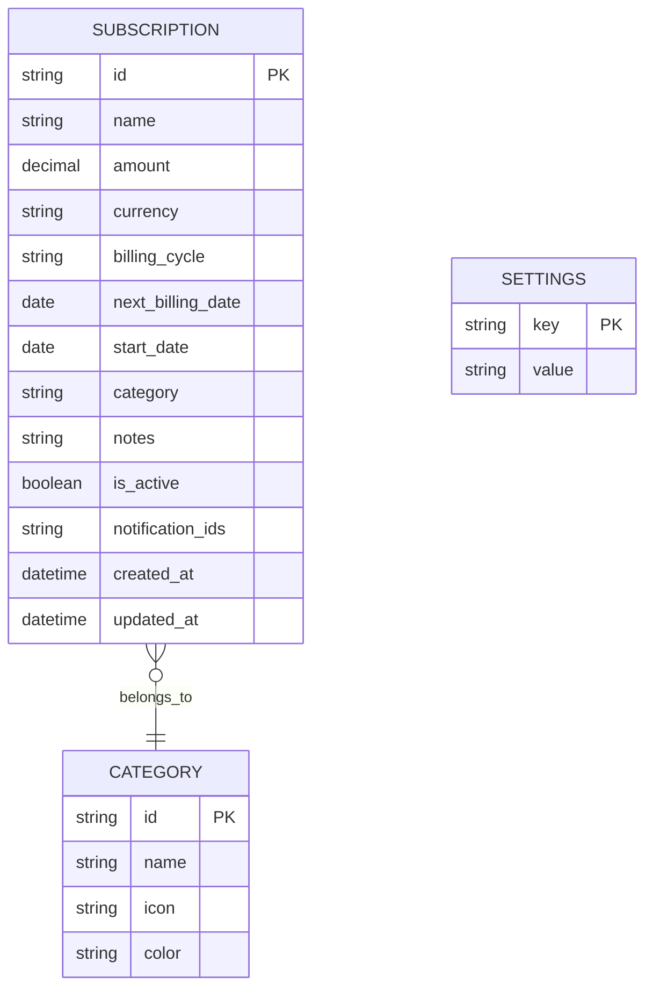

# SubTracker - Architecture Document

## Metadata
- Version: 1.0
- Last Updated: 2025-01-27
- Depends On: None (root document)
- Breaking Changes: No

---

## Project Context

**Project Name:** SubTracker - Personal Subscription & Bills Tracker

**Problem Statement:**
Users struggle with forgotten subscriptions, unclear billing cycles, and unreliable reminders leading to:
- Unexpected charges from forgotten services
- Missed bill payments resulting in late fees
- No consolidated view of recurring expenses
- Difficulty tracking total monthly/yearly subscription costs

**Target Users:**
- Individuals managing personal subscriptions (streaming, software, gym, etc.)
- Users who want visibility into their recurring expenses

**Constraints:**
- Mobile-first (React Native/Expo)
- Offline-capable with local SQLite storage
- Free push notifications (Expo Push)
- No paid backend required for MVP (local-first)
- Simple, single-user design

**Non-Goals (Out of Scope for MVP):**
- Bank/credit card integration
- Multi-user/family sharing
- Subscription cancellation automation
- Receipt scanning/OCR
- Cloud sync across devices

---

## System Architecture

### High-Level Overview

### Component Responsibilities

| Component | Responsibility |
|-----------|----------------|
| UI Layer | Screens, forms, subscription list, dashboard |
| Business Logic | CRUD operations, billing calculations, reminder scheduling |
| Notification Manager | Schedule/cancel local & push notifications |
| SQLite Database | Persistent local storage for subscriptions & settings |
| Expo Push | Deliver reminder notifications |

---

## Data Flow

### Add Subscription Flow

### Reminder Trigger Flow

---

## Database Schema Overview

---

## Key Architecture Decisions

| Decision | Reasoning |
|----------|-----------|
| Local-first SQLite | No backend costs, works offline, privacy-preserving |
| Expo/React Native | Cross-platform, free push notifications, rapid development |
| Local notifications as primary | Works without internet, reliable scheduling |
| Single currency per subscription | Simplifies MVP, avoids exchange rate complexity |
| Category as separate entity | Allows custom categories, reusable icons/colors |

---

## Risks & Mitigations

| Risk | Impact | Mitigation |
|------|--------|------------|
| Notification not firing (app killed) | Missed reminder | Use Expo scheduled notifications (OS-level) |
| Database corruption | Data loss | Implement export/backup feature in v2 |
| Timezone confusion | Wrong reminder times | Store all dates in UTC, convert on display |
| App uninstalled = data lost | Complete data loss | Document this limitation, plan cloud sync for v2 |

---

## MVP Feature Set

1. **Subscription Management**
   - Add/Edit/Delete subscriptions
   - Track name, amount, billing cycle, next billing date, category

2. **Dashboard**
   - Monthly/yearly spending summary
   - Upcoming bills (next 7/30 days)
   - Active subscription count

3. **Reminders**
   - Configurable reminder days before billing (1, 3, 7 days)
   - Push notifications

4. **Categories**
   - Pre-defined categories (Streaming, Software, Fitness, etc.)
   - Category-based filtering

---

## Downstream Dependencies

| Agent | Depends On |
|-------|------------|
| Backend Engineer | This architecture for schema design |
| Security Engineer | This architecture for threat modeling |
| QA Engineer | This architecture for failure mode analysis |
| Observability | This architecture for logging strategy |
